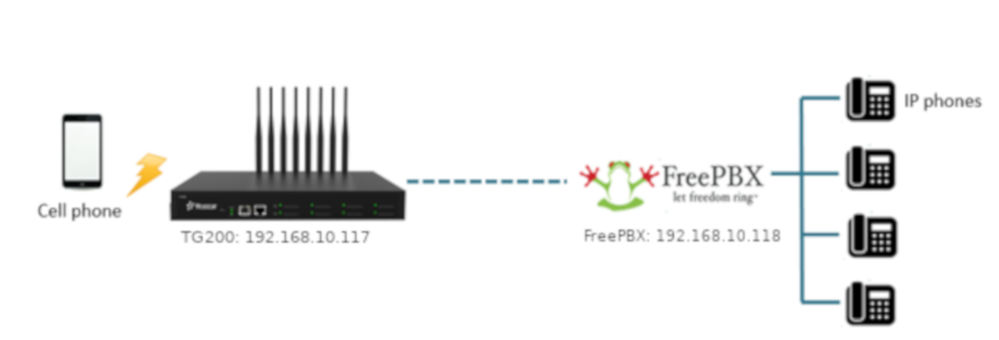

# Thiết lập hệ thống tổng đài với FreePBX và GSM Gateway

 

Một số nội dung:

- [Giới thiệu về Asterisk + FreePBX + GSM](docs/About-Asterisk-FreePBX-GSM.md)

- [Thiết lập tổng đài VoIP với FreePBX Distro](docs/Setup-FreePBX.md)

- [Thiết lập kết nối GSM gateway và FreePBX](docs/Setup-FreePBX-GSM-Gateway.md)

Updating ...
