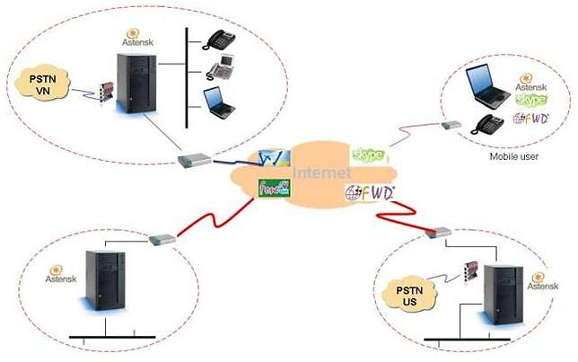
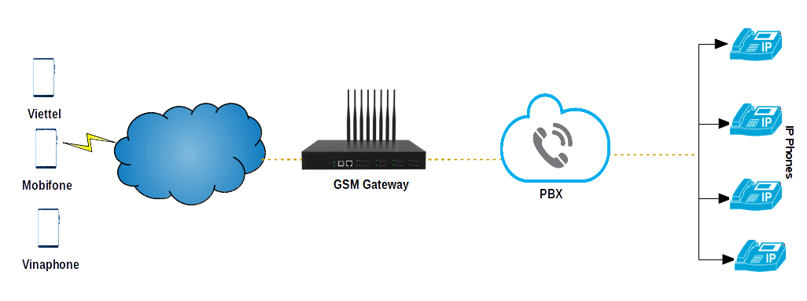

# Asterisk FreePBX System

# Tables of contents

- [1. Về Asterisk](#about-asterisk)
- [2. FreePBX Distro](#freepbx-distro)
- [3. Về mô hình kết nối GSM Gateway và FreePBX](#about-gsmgateway-freepbx)

## 1. Về Asterisk

Asterisk là phần mềm dùng làm tổng đài điện thoại - Private Branch Excahnge (PBX). Kết hợp với các giao diện phần cứng điện thoại phù hợp và các ứng dụng mạng, Asterisk được sử dụng để thiết lập và kiểm soát các cuộc gọi giữa các điểm cuối viễn thông, cho phép thực hiện các cuộc gọi nội bộ với nhau, hoặc kết nối với với hệ thống mạng điện thoại chuyển mạch công cộng - Public switched telephone network (PSTN) và các thiết bị hoặc dịch vụ thoại qua mạng IP (VoIP).

Asterisk hỗ trợ nhiều chuẩn giao thức của VoIP như SIP và H.323, MGCP. Nó có thể hoạt động như trạm kết nối giữa các IP phone và mạng PSTN qua giao diện T- hoặc E-carrier hoặc card analog FXO.

Asterisk ra đời vào năm 1999 bởi Mark Spencer, hiện nay thì nó được phát triển bởi Sangoma Technologies Corporation.

Asterisk là phần mềm nguồn mở và nó có thể chạy trên nhiều nền tảng OS như Linux, BSD, MacOS, ..

Mô hình giải pháp tổng đài Asterisk

Một số tính năng chính của Asterisk:

- Voicemail: Tính năng cho phép thực hiện thư thoại. Khi điện thoại bận thì asterisk định hướng cuộc gọi đến hộp thư thoại tương ứng đã khai báo trước

- IVR (Interactive Voice Response): Được dùng để chỉ chức năng tương tác thoại (tổng đài trả lời tự động).

- Conference calling: Tính năng cho phép cuộc gọi đàm thoại giữa nhiều người, và có thể thiết lập người nhận cuộc gọi chỉ có thể nghe và không có thể nói.

- Automated Call Distribution: Hệ thống sẽ tự động phân phối cuộc gọi phù hợp với tương tác của người dùng đối với hệ thống.

- Call Forwarding: Tính năng chuyển hướng cuộc gọi khi máy đang bận hoặc không trả lời

## 2. FreePBX Distro

Trước đây, việc xây dựng hệ thống tổng đài Asterisk được thực hiện thủ công với các bước sau:

- Dựng hệ điều hành phù hợp (Thường là linux như CentOS)

- Download, cài đặt và cấu hình Asterisk trên OS. Việc cấu hình Asterisk được thao tác trên từng tệp tin.

- Cài đặt và tích hợp gói DAHDI (Zaptel) để cho phép Asterisk giao tiếp với điện thoại analog hoặc hệ thống PSTN

...

Việc thao tác nhiều công việc thủ công như vậy chiếm rất nhiều thời gian và dễ xảy ra sai xót. Vì vậy mà hiện nay, nhiều bản distro ra đời mà tích hợp đầy đủ các thành phần của việc xây dựng hệ thống tổng đài như OS, Asterisk, Giao diện, DAHDI và nhiều gói hỗ trợ khác, giúp cho việc triển khai được nhanh chóng và chính xác hơn.

Một số bản distro Asterisk phổ biến hiện nay:

- Elastix – Debian Linux Asterisk Distribution

- PBXinaflash – Linux PBX

- FreePBX – Based on CENTOS – most module require payment

FreePBX Distro là bản OS dựa trên CentOS, gồm giao diện đồ họa (FreePBX) cho cấu hình và quản lý Assterisk. FreePBX Distro gồm các gói cài đặt mà cung cấp các tính năng như VoIP, PBX, Fax, IVR, Voicemail.

## < a name="about-gsmgateway-freepbx">3. Về mô hình kết nối GSM Gateway và FreePBX</a>

Logic thông thường của cuộc gọi điện thoại là: một người dùng điện thoại gắn sim gọi với một người sử dụng điện thoại gắn sim khác. Vậy với 10 người dùng gọi tới 10 người dùng khác thì sẽ cần 10 sim điện thoại.

Nhu cầu thực tế của doanh nghiệp đặt ra là:

- Có thể sử dụng gọi nội bộ mà không mất chi phí

- Tiết kiệm chi phí cuộc gọi ra ( nghĩa là gọi số của nhà mạng nào thì tự động định tuyến qua SIM của nhà mạng đó)

- Khi một người trong hệ thống bận hoặc không trả lời, người khác có thể thực hiện nhận cuộc gọi đó.

- Lưu trữ ghi âm cuộc gọi tập trung

...

Khi đó, mô hình hệ thống tổng đài kết hợp thiết bị gắn các SIM card (GSM Gateway) ra đời để đáp ứng yêu cầu trên.

 

**Các GSM Gateway thường có các tính năng như sau**:

- Cho phép kết nối với các tổng đài IP

- Sử dụng với các nhà mạng như Viettel, Mobifone, Vinaphone, Gphone...

- Tự động định tuyến số điện thoại gọi ra theo nhà mạng (nghĩa là gọi số của nhà mạng nào thì tự động định tuyến qua SIM của nhà mạng đó)

 Cho phép giới hạn thời gian mỗi cuộc gọi, thời gan của mỗi sim

- Hiển thị trạng thái cuộc gọi đi, đến

Ngoài ra, một số GSM còn hỗ trợ API cho phép kết nối từ các phần mềm cho thông tin về các cuộc gọi, như sử dụng cho CRM, …
