# FreePBX và GSM Gateway Yeastar TG200

# Table of contents

- [1. Giới thiệu](#about)
- [2. Cấu hình kết nối Yearstar TG200 và FreePBX](#connect-tg200-freepbx)
  - [2.1 Tạo VoIP Trunk trên TG200](#trunk-TG200)
  - [2.2 Tạo VoIP Trunk trên FreePBX](#trunk-freepbx)
  - [2.3 Tạo một extension trên FreePBX](#create-extension)
- [3. Cấu hình Incoming call vào FreePBX](#incoming-call)
  - [3.1 Tạo route Mobile to IP trên TG200](#route-mobile-to-ip)
  - [3.2 Cấu hình Inbound Route trên FreePBX](#inbound-route-freepbx)
- [4. Cấu hình Outgoing call từ FreePBx qua TG200](#outgoing-call)
  - [4.1 Cấu hình Outbound Route trên FreePBX](#outbound-route-freepbx)
  - [4.2 Tạo route IP to Mobile trên TG200](#route-ip-to-mobile)
- [5. Kiểm tra cuộc gọi](#check-call)

==================================================================

# Contents

## <a name="about">1. Giới thiệu</a>

Hướng dẫn step-by-step cách cấu hình kết nối GSM Gateway và FreePBX (GSM Gateway trong trường hợp này tôi sẽ sử dụng Yeastar TG200 cho test).  Khi đó GSM trunk trên Yearstar TG200 sẽ mở rộng trên hệ thống FreePBX. Mục đích đạt được:

- Thực hiện cuộc gọi ra từ hệ thống FreePBX qua GSM trunks của Yearstar gateway.

- Thực hiện nhận cuộc gọi từ bên ngoài vào thông qua hệ thống GSM trunks of Yearstar gateway đến hệ thống FreePBX

Mô hình hệ thống như sau:

 
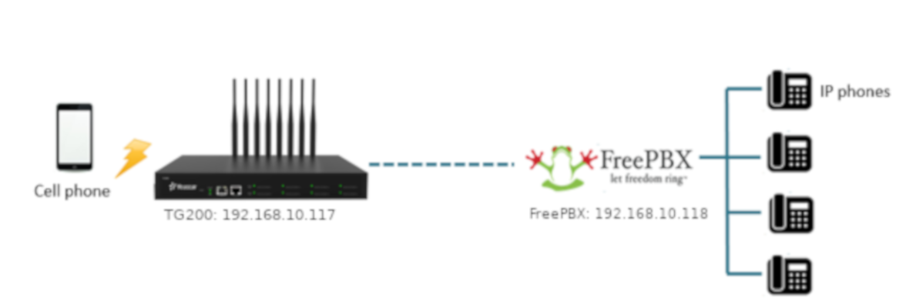

Thông số sẽ thực hiện:

- GSM Gateway Yearstar TG200 và FreePBX sử dụng chế độ **Service provider** để thực hiện kết nối với nhau.

- Yearstar TG200: 192.168.10.117/24

- FreePBX: 192.168.10.118/24

- GSM1: +84906226654

## <a name="connect-tg200-freepbx">2. Cấu hình kết nối Yearstar TG200 và FreePBX</a>

### <a name="trunk-TG200">2.1 Tạo VoIP Trunk trên TG200</a>

Path: Gateway> VoIP Settings> VoIP trunk> Add VoIP Trunk.
Khi đó thực hiện chọn mode là “Service Provider”, và điền địa chỉ IP của FreePBX (192.168.10.118)

 
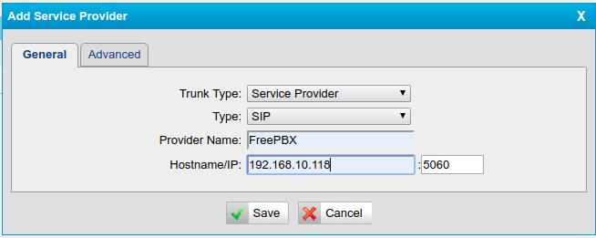

Trong đó:

- Trunk Type: Service Provider

- Type: SIP

- Provider Name: FreePBX

- Hostname/IP: địa chỉ IP của FreePBX server (192.168.10.118)

Sau đó thực hiện Save → Apply

Kiểm tra trạng thái trunk

 
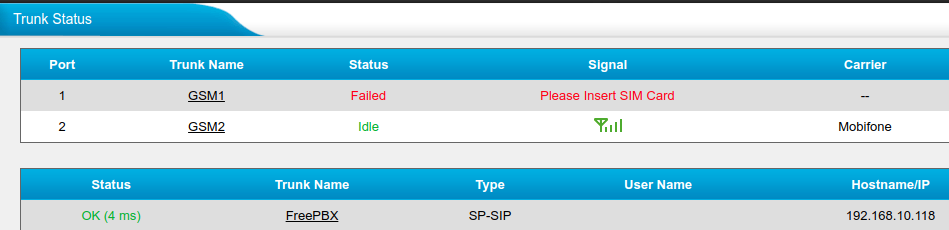

### <a name="trunk-freepbx">2.2 Tạo VoIP Trunk trên FreePBX</a>

Path: Connectivity> Trunks> Add Trunks> Add SIP (chan_pjsip) Trunk

 
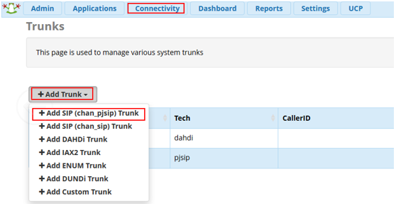

Vào thông tin trong tab General, với Trunk Name là “TG200”

 
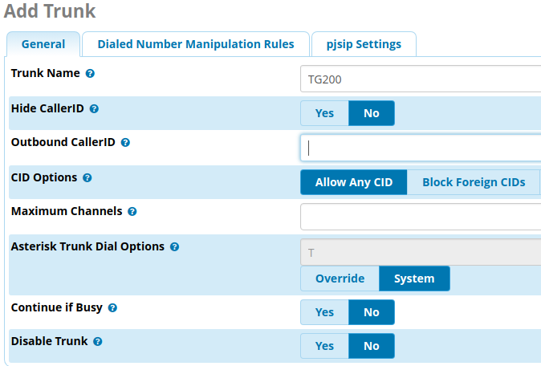

Tiếp đến, chuyển qua tab **pjsip Settings** để thiết lập PJSIP

Ở tab General:

 
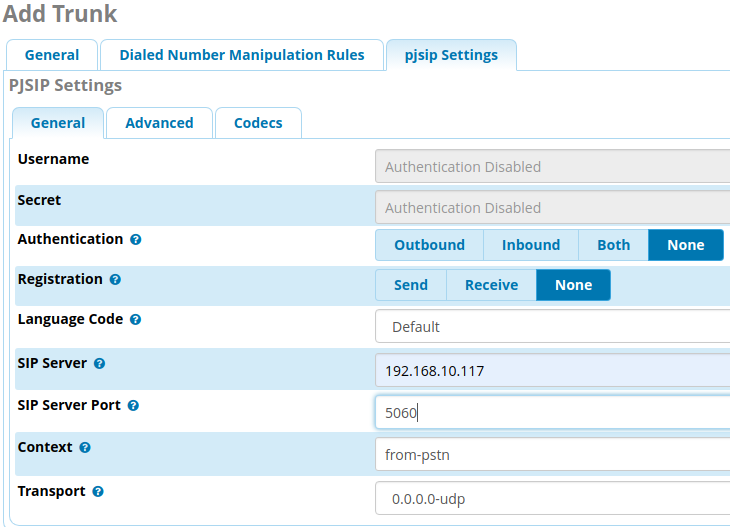

- Chọn chế độ “Authentication” là None, để tắt chứng thực

- Vào thông tin SIP server là địa chỉ IP của GSM TG200 gateway (192.168.10.117)

- SIP Server Port là 5060 (default)

Tiếp tục qua tab **Advanced**:

 
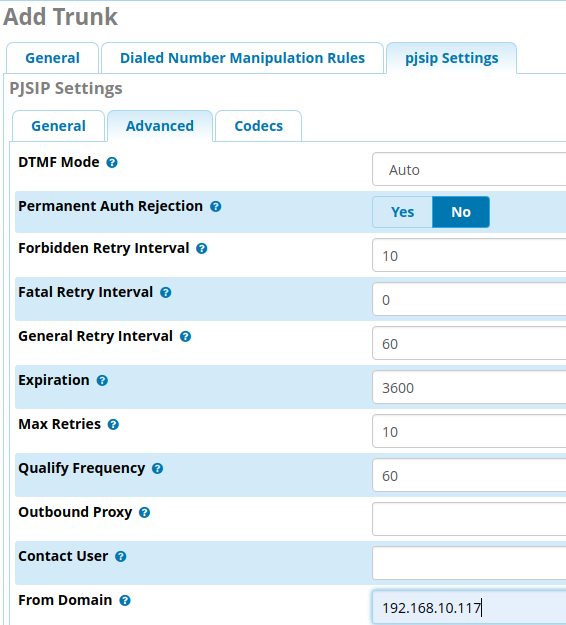

- Chọn giá trị No cho “Permanent Auth Rejection” để không bắt lỗi chứng thực khi gateway kết nối.

- Vào thông tin **From Domain** là địa chỉ IP của gateway, mục đích là khi gateway request đến trunk trên FreePBX nó sẽ hiện thông tin header request của gateway TG200.

Sau đó thực hiện Submit → Apply Config

### <a name="create-extension">2.3 Tạo một extension trên FreePBX</a>

Mở Applications> Extensions> Add Extension> Add New Chan_SIP Extension

 
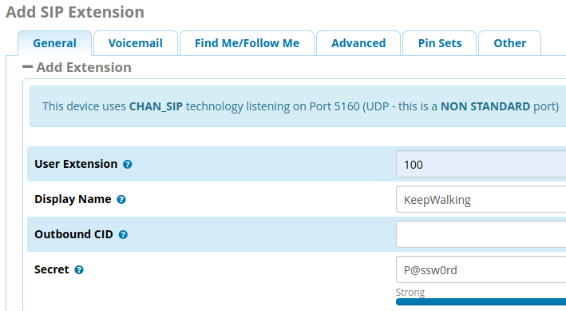

Thực hiện tạo một extension Chan_SIP với thông tin:

- User Extension: Vào thông tin số mở rộng dùng khi dial

- Display Name: Thiết lập tên hiển cho số này khi gọi

- Secret: Vào thông tin mật khẩu cho tài khoản này

Note: Cả Chan_SIP và PJSIP đều có thể cho phép tạo extension number nhưng Chan_SIP cho phép hỗ trợ NAT. Hiện tại thì PJSIP được sử dụng cho default SIP (với port 5060), Chan_SIP sử dụng port 5160.

Để tạo các tài khoản khoản cho SIP extension gồm cả Chan_SIP và PJSIP, chúng ta thực hiện như các bước ở trên.

## <a name="incoming-call">3. Cấu hình Incoming call vào FreePBX</a>

Phần này, chúng ta sẽ cấu hình để cho phép thực hiện cuộc vào từ bên ngoài vào hệ thống FreePBX. Cuộc gọi đầu tiên sẽ đi qua GSM gateway TG200. TG200 sẽ chuyển tiếp cuộc gọi vào hệ thống FreePBX. FreePBX thực hiện phân phối cuộc gọi đến số extension phù hợp.

 

### <a name="route-mobile-to-ip">3.1 Tạo route Mobile to IP trên TG200</a>

Trên TG200, Mở Gateway> Route Settings > Mobile to IP

 
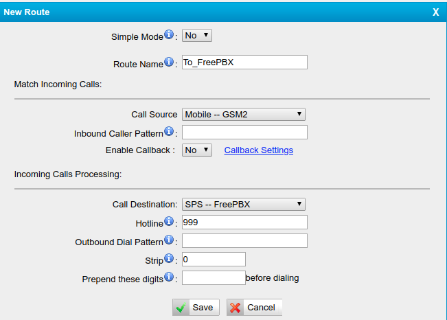

Vào các thông tin sau:

- Simple Mode: No (để show thêm một số thông tin tùy chọn, nếu chọn Yes thì cấu hình ở chế độ rút gọn)

- Route Name: đặt tên để route từ gateway TG200 đến FreePBX, ở đây đặt tên “To_FreePBX”

- Call Source: Hiện tại tôi đang cắm SIM ở khe số 02, vì vậy chọn Mobile-GSM2. Ở đây, chúng ta gắn sim ở khe nào thì chọn Call Source phù hợp.

- Call Destination: Lựa chọn SPS-FreePBX. Khi đó tất cả cuộc gọi đến GSM2 sẽ được chuyển đến FreePBX qua trunk này.

- Hotline: 999, đặt một số bất kỳ mà cùng với số DID trên FreePBX trong cấu hình inbound và outbound.

### <a name="inbound-route-freepbx">3.2 Cấu hình Inbound Route trên FreePBX</a>

Thực hiện cấu hình “Inbound Routes” để cho phép nhận chuyển tiếp từ gateway TG200 vào FreePBX

Mở Connectivity> Inbound Routes> Add Inbound Route

 
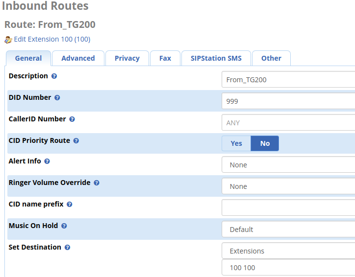

- Description: Vào thông tin mô tả cho Inbound Routes

- DID Number: 999 (cùng thông tin số hotline trên TG200)

- Set Destination: Chọn Extension và chọn số extension đã tạo, ở đây là 100. Khi đó từ bên ngoài gọi vào số mobile gắn trên sim, sẽ chuyển tiếp cuộc gọi đến thiết bị cài đặt SIP có extension 100.

## <a name="outgoing-call">4. Cấu hình Outgoing call từ FreePBx qua TG200</a>

Phần này, chúng ta sẽ cấu hình để cho phép thực hiện cuộc vào từ một số extension ra ngoài qua TG200. Đầu tiên cuộc gọi từ FreePBX sẽ kết nối GSM gateway TG200. TG200 chọn một giá trị định tuyến phù hợp, mà sẽ qua GSM nào (có thể qua một GSM hoặc một nhóm GSM) và thực hiện kết nối ra bên ngoài.

Thực hiện cấu hình như sau:

### <a name="outbound-route-freepbx">4.1 Cấu hình Outbound Route trên FreePBX</a>

Mở FreePBX > Connectivity> Outbound routes> Add Outbound Route

 
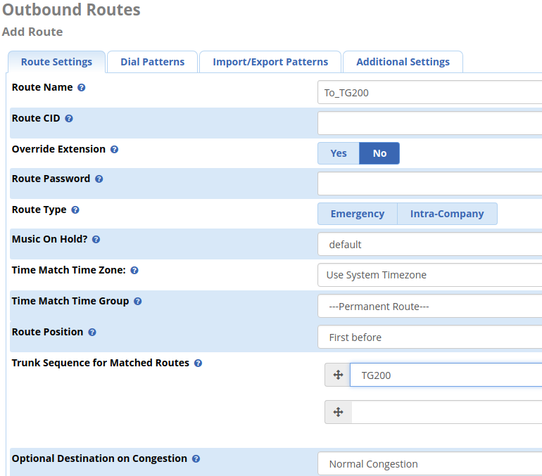

Tab “Route Settings”, vào các thông tin như sau:

- Route Name: Vào tên cho route, ở đây là To_TG200

- Trunk Sequence for Matched Routes: Chọn tên Trunk đã tạo ở 2.2 cho kết nối Trunk đến gateway TG200. Ở đây tên Trunk đã tạo trước đó là “TG200”

Tiếp đó chuyển qua tab **Dial Parterns**

 
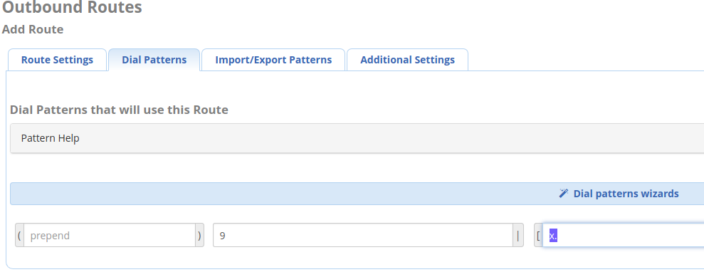

- prefix: 9. Là số đứng trước số cần gọi ra (Ví dụ gọi 0988888888, thì từ thiết bị cài đặt số extension sẽ ấn các phím `90988888888` để thực hiện cuộc gọi ra)

- match parttern: chúng ta vào giá trị “X.” (X đúng với giá trị các số 0-9)

### <a name="route-ip-to-mobile">4.2 Tạo route IP to Mobile trên TG200</a>

Mở TG200 → Gateway → Route Settings → IP to Mobile → Add IP to Mobile Route

 
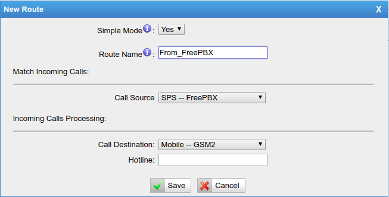

Với các thông tin sau:

- Route Name: Đặt tên route, From_FreePBX

- Call Source:  Lựa chọn SPS-FreePBX

- Call Destination: Chọn khe sim 2 (GSM2) đang kết nối.

## <a name="check-call">5. Kiểm tra cuộc gọi</a>

**Step1**: Cài đặt phần mềm VoIP

Tìm phần mềm nào hỗ trợ VoIP thì thực hiện cài đặt. Ở đây tôi dùng thấy Zoiper thấy ổn, có cả bản trên mobile và computer.

Thực hiện thiết lập SIP account trên Zoiper với thông tin extension đã tạo trên FreePBX

 
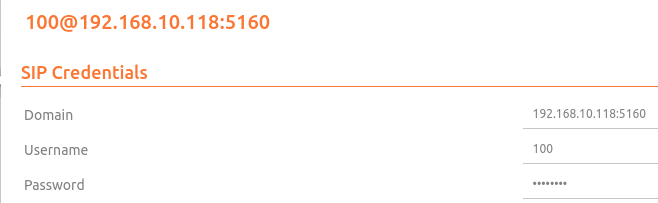

**Step2**: Kiểm tra cuộc gọi vào

Sử dụng mobile gắn sim và thực hiện cuộc gọi vào số gắn trên GSM2. Khi đó kiểm tra trên thiết bị cài đặt extension 100

 
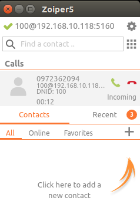

Khi đó nhận được cuộc gọi từ số mobile hiện 

**Step3**: Kiểm tra cuộc gọi ra

Từ thiết bị mà cài đặt extension, thực hiện gọi ra một số mobile

 
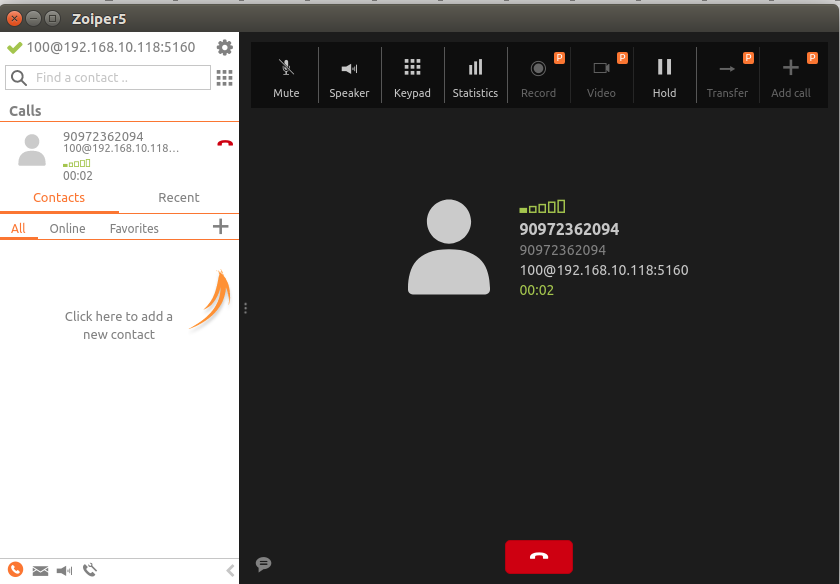

**Read more**:

[How-to-Connect-FreePBX-to-Yeastar-TG-Gateway](https://support.yeastar.com/hc/en-us/articles/115011635787-How-to-Connect-FreePBX-to-Yeastar-TG-Gateway)
