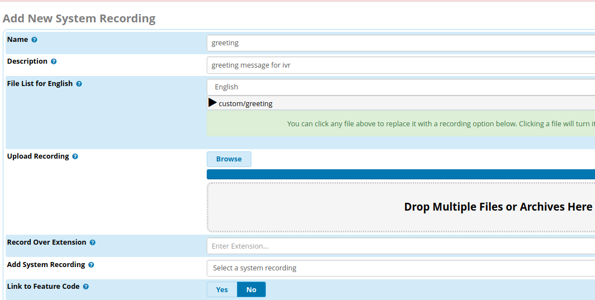
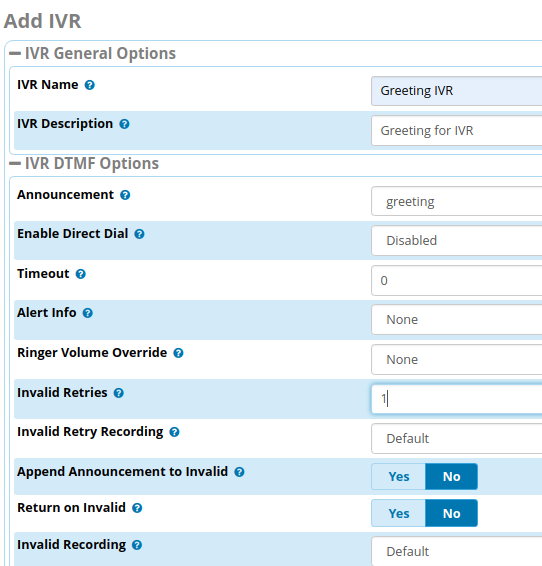

# Setup FreePBX

# Table of contents

- [1. Cài đặt FreePBX](#install-freepbx)
- [2. Tạo extension - máy nhánh](#add-extensions)
- [3. Chuyển hướng cuộc gọi](#follow-me)
- [4. Hệ thống trả lời tự động - IVR](#IVR)
- [5. Cấu hình hệ thống](#configure-system)
  - [5.1 Cấu hình NAT](#configure-nat)
  - [5.2 Thiết lập email gửi thông báo](#setup-email)
  - [5.3 Thiết lập backup-restore](#backup-restore)

# Contents

## <a name="install-freepbx" >1. Cài đặt FreePBX</a>

Download Freepbxdistro at [http://downloads.freepbxdistro.org/ISO/](http://downloads.freepbxdistro.org/ISO/)

FreePBX distro các bản mới có tên gọi là SNG7-FPBX, nó dựa trên bản phân phối RHEL7.

Bản mới nhất hiện đang là SNG7-FPBX-1805, gồm các thành phần chính sau:

- FreePBX 14

- CentOS 7

- Asterisk 13 or 15

Download tại: [SNG7-FPBX-64bit-1805-2.iso](https://downloads.freepbxdistro.org/ISO/SNG7-FPBX-64bit-1805-2.iso)

Sau khi cài đặt xong, truy cập FreePBX server và cấu hình network. Cách cấu hình network tương tự với CentOS/RHEL.

```
DEVICE="eth0"
ONBOOT="yes"
IPADDR=192.168.10.118
NETMASK=255.255.255.0
GATEWAY=192.168.10.1
DNS1=8.8.8.8
DNS2=1.1.1.1
```

Sau đó thực hiện restart network

`systemctl restart network`

Tiếp theo mở web browser và truy cập FreePBX theo địa chỉ [http://192.168.10.118](http://192.168.10.118)

Màn hình khởi tạo đầu tiên yêu cầu tạo tài khoản cho quản trị hệ thống FreePBX.

<p align="center"> 

</p>

Sau khi vào thông tin tài khoản, nhấn Create Account để tạo tài khoản quản trị.

Màn hình chính FreePBX, xuất hiện gồm 04 options:

<p align="center"> 

</p>

- FreePBX Administration: cho phép chúng ta cấu hình FreePBX, với thông tin tài khoản quản trị vừa tạo ở trên.

- User Control Panel: Là nơi người dùng có thể login và thực hiện gọi qua giao diện web, thiết lập nút phone, xem voicemail, gửi tin nhắn SMS & XMPP, … (Thông tin tài khoản login cho option này nằm ở module User Management

- Operator Panel: Là màn hình mà cho phép operator để kiểm soát cuộc gọi

- Get Support: Chuyển hướng support sang trang chủ FreePBX

Chúng ta chọn “FreePBX Administration” để login vào trang quản trị FreePBX

Tại màn hình chính là Dashboard của FreePBX với các thông tin tổng quan, thống kê số liệu hệ thống, network, trạng thái dịch vụ, ...

<p align="center"> 

</p>

## <a name="add-extensions">2. Tạo extension - máy nhánh</a>

Chúng ta thực hiện tạo số máy nhánh (hay SIP Account hoặc Extension)

Trong giao diện chính mở: Applications> Extensions> Add Extension> Add New Chan_SIP Extension

<p align="center"> 

</p>

Thực hiện tạo một extension Chan_SIP với thông tin:

- User Extension: Vào thông tin số máy nhánh dùng khi dial, ở đây là 100

- Display Name: Thiết lập tên hiển thị KeepWalking cho số nhánh này

- Secret: Vào thông tin mật khẩu cho tài khoản này (Ở đây tôi đặt P@ssw0rd)

**Note**: Cả Chan_SIP và PJSIP đều cho phép tạo extension number nhưng Chan_SIP cho phép hỗ trợ NAT. Hiện tại thì PJSIP được sử dụng cho default SIP (với port 5060), Chan_SIP sử dụng port 5160.

Để tạo các tài khoản khoản cho SIP extension gồm cả Chan_SIP và PJSIP, chúng ta thực hiện như các bước ở trên.

<p align="center"> 

</p>

## <a name="follow-me">3. Thiết lập chuyển hướng cuộc gọi</a>

Trên giao diện web của FreePBX, chúng ta có thể cấu hình để cho phép chuyển hướng cuộc gọi (với tùy chọn Follow Me) từ một số khi số đó không answer hoặc busy.

Chúng ta cấu hình chuyển hướng cuộc gọi từ số 100 đến 101 khi số máy 100 không answer hoặc busy.

**Step1: Enable Follow Me**

Mở Applications → Follow Me

<p align="center"> 

</p>

Khi đó chọn **Yes** cho số extension cần enabled tính năng **Follow Me**

**Step2: Edit extensions**

Mở Applications → Extensions (Hoặc mở Application → Follow Me)

Khi đó chọn số extension cần edit, ví dụ ở đây là **100**

<p align="center"> 

</p>

Khi đó vào các thông số sau:

- Ring Time (max 60 sec): thiết lập khoảng thời gian tối đa rung chuông, nếu sau khoảng thời gian này extension 100 không trả lời thì sẽ forward sang Extensions 101. Ta thiết lập khoảng time là 20sec.

- Destination if no answer: chọn Extension và chọn số nhánh sẽ forward. Ở đây, chúng ta thiết lập khi số 100 không answer hoặc busy thì sẽ forward cuộc gọi đến số 101.
Cuối cùng nhấn Submit → Apply Config

## <a name="IVR">4. Hệ thống trả lời tự động - IVR</a>

Mục đích phát thông điệp từ tệp audio đến người gọi (caller) từ bên ngoài gọi vào hệ thống tổng đài. Các bước thực hiện như sau:

**Step1**: Tạo System Recordings

Chúng ta sẽ cấu hình module **System Recordings** để ghi âm hoặc upload các tệp tin audio làm thông điệp và phát lại cho caller ở một module khác. Trong trường hợp này, tôi sẽ upload tệp tin audio làm lời chào cho hệ thống trả lời tự động (IVR).

Thực hiện như sau:

Mở Admin → System Recordings → Add Recording

Sau đó vào các thông tin sau:

- Phần Name & Description đặt tên và mô tả phù hợp cho thông điệp sẽ phát. Chẳng hạn phát thông điệp lời chào và hướng dẫn nhấn phím để truy cập bộ phận .. Ở đây, tôi  đặt greeting.

- File List for english: Chúng ta có thể browser hoặc kéo tệp tin audio đã có sẵn với một số định dạng như waw, law, ..

**Note**:

Ở đây, chúng ta có thể sử dụng nhiều tệp tin audio cho một System Recording. Nó sẽ phát lần lượt từng tệp audio theo thứ tự từ trên xuống.

Đường dẫn lưu tệp tin audio mặc định là **/var/lib/asterisk/sounds/en/custom**

<p align="center"> 

</p>

Cuối cùng nhấn Submit → Apply Config để tạo một system recording.

**Step2**: Tạo IVR

Module IVR cho phép tạo các hệ thống trả lời tự động (IVR), từ đó chúng ta có thể điều hướng cuộc gọi từ ngoài vào một trong các IVR này.

Thực hiện tạo IVR như sau:

Mở Applications → IVR → Add IVR

Sau đó vào các thông tin sau:

- Phần IVR Name và IVR Description đặt tên và mô tả cho tạo một IVR phù hợp. Ở đây, tôi đặt tên một IVR là **Greeting IVR**

- Announcement: Chọn thông điệp sẽ phát. Ở đây chúng ta sẽ chọn **greeting** mà đã tạo ở  System Recordings trong Step1.

- Enable Direct Dial: Enabled tùy chọn này để phép caller có thể dial đến một extension trong khi đang nghe phát một thông điệp (Tức là có thể dial extension như 100 mà không cần nhấn phím một phím để gặp bộ phận xxx nào đó). Nếu không cho phép thực hiện dial extension như vậy thì chọn tùy chọn Disabled

- Timeout: Thiết lập lượng thời gian (second) mà hệ thống sẽ người gọi quay số. Sau khoảng thời gian này, nếu người gọi không thực hiện quay số thì hệ thống thực hiện một số tùy chọn tiếp theo.

- Invalid Retries: Thiết lập số lần cho phép người gọi chọn lại phím số khi nhấn sai phím cần chuyển hướng đến số extension. (ví dụ chỉ thiết lập số 1 gọi đến 101, nhưng người gọi nhấn phím 2 sẽ là phím sai, yêu cầu thực hiện lại).

<p align="center"> 

</p>

Tiếp đó trong phần IVR Entries, chúng thiết lập các phím dial tùy chọn để hệ thống direct đến extension phù hợp

- Digits: Chọn phím để nhấn (ví dụ nhấn phím 1 để direct)

- Destination: Chọn tùy chọn Extensions và chọn extension phù hợp( chẳng hạn 100 KeepWalking)

Tiếp tục nhấn Add Another Entry để thêm phím khác

<p align="center"> 

</p>

Sau đó thực hiện nhấn Submit → Apply Config

**Step3**: Cấu hình Inbound Routes

Sau khi tạo xong Step1 và Step2, chúng ta thực hiện định tuyến Inbound để cho phép người gọi vào hệ thống tổng đài và chuyển vào IVR.
Trong phần trước, chúng ta đã hướng dẫn cấu hình Inbound Routes. Phần này, chúng ta edit lại phần Inbound Routes đó.

<p align="center"> 

</p>

Mở Connectivity → Inbound Routes → Chọn một Inbound Route và thực hiện chỉnh sửa

<p align="center"> 

</p>

- Set Destination: Thiết lập đích route là IVR và chọn tên IVR là Greeting IVR đã tạo ở Step2

Cuối cùng nhấn Submit → Apply Config

## <a name="configure-system">5. Cấu hình hệ thống</a>

### <a name="configure-nat">5.1 Cấu hình NAT</a>

Trong trường hợp công ty có nhiều văn phòng hoặc người dùng ở ngoài văn phòng và có nhu cầu sử dụng hệ thống tổng đài. Khi đó, chúng ta cần publish tổng đài ra internet hoặc cấu hình truy cập với kết nối VPN.

Trong phần này chúng ta sẽ giới thiệu phần cấu hình publish tổng đài ra internet

<p align="center"> 

</p>

**Step1**: NAT từ Router đến FreePBX

Trên Router chúng ta sẽ NAT các ports sau đến FreePBX

- 5060 UDP - Port SIP

- 10000-20000 UDP - Dải ports cho RTP Media

**Step2**: Thêm thông tin NAT trên FreePBX

Mở Settings → Assterisk SIP Settings

Tại tab General SIP Settings

<p align="center"> 

</p>

Trong phần **NAT Settings** vào các thông tin sau:

- External Address: Vào địa chỉ Public IP của router NAT đến FreePBX, ở đây ví dụ là 1.2.3.4

- Local Networks: Vào thông tin subnet của LAN của FreePBX

Trong phần **RTP Settings** vào thông tin sau:

- RTP Port Ranges: Vào dải ports 10000-20000 để cho phép truyền tệp tin, video, audio qua mạng

Tại tab Chan SIP Settings

<p align="center"> 

</p>

- NAT: tích chọn yes để luôn thực hiện NAT

- IP Configuration: Chọn Static IP và vào thông tin Public IP trên router sẽ NAT xuống FreePBX

Sau khi vào sau các thông tin NAT cho FreePBX thì thực hiện Submit → Apply Config

### <a name="setup-email">5.2 Thiết lập email gửi thông báo</a>

FreePBX chỉ hỗ trợ thiết lập thông tin SMTP server để gửi email thông báo và voicemail qua giao diện với bản Pro. 

Với bản free của FreePBX, chúng ta sẽ thiết lập cấu hình thủ công như sau:

Yêu cầu cài đặt: 
- Cài đặt Postfix trên FreePBX server

**Step1**: Cấu hình relay mail server

Chúng ta sẽ cấu hình postfix để thực hiện relay mail.

Sửa tệp tin /etc/postfix/main.cf và thêm các thông tin sau vào cuối tệp

```
#enable SASL authentication
smtp_sasl_auth_enable = yes
#disallow methods that allow anonymous authentication.
smtp_sasl_security_options = noanonymous
#path to sasl_passwd file
smtp_sasl_password_maps = hash:/etc/postfix/sasl_passwd
#enable STARTTLS encryption
smtp_use_tls = yes
#path to CA certificates
smtp_tls_CAfile = /etc/ssl/certs/ca-certificates.crt
#specify SMTP relay host
relayhost = [mail.example.com]:587
```
Thay địa chỉ [mail.example.com]:587 với địa chỉ mail server phù hợp của bạn. Chẳng hạn chúng ta chỉ sử dụng port 25, với địa chỉ smtp.your-company.com khi đó thay với
[smtp.your-company.com]:25

**Step2**: Cấu hình username và password

Để có thể gửi mail, chúng ta cần tài khoản smtp email để xác thực với SMTP server.

Khi đó tạo tệp tin /etc/postfix/sasl_passwd chứa thông tin tài khoản smtp email cho xác thực

`syntax: [mail.your-company.com]:port username:password`

Ví tạo tệp tin với tài khoản email như sau:

`mail.example.com:587 info@example.com:P@ssword`

Thay địa chỉ smtp server và tài khoản xác thực với thông tin phù hợp của bạn.

**Step3**: Tạo tệp tin hash db cho Postfix

Chúng ta sử dụng lệnh **postmap** để tạo tệp hash db như sau:

`postmap /etc/postfix/sasl_passwd`

Khi đó nó sẽ generate ra tệp tin **/etc/postfix/sasl_passwd.db**

Để đảm bảo an toàn hơn cho tệp tin chứa thông tin username/password cho xác thực smtp server, chúng ta hạn chế quyền truy cập tệp tin như sau:

```
chown root:root /etc/postfix/sasl_passwd /etc/postfix/sasl_passwd.db
chmod 0600 /etc/postfix/sasl_passwd /etc/postfix/sasl_passwd.db
```

**Step4**: Thực hiện restart Postfix và kiểm tra gửi mail

`service postfix restart`

Kiểm tra thực hiện gửi mail

echo "Body of email" | mailx -r "info@example.com" -s "SUBJECT" "keepwalking@example.com"`

Dưới đây là một thông báo voicemail gửi từ FreePBX

```
VICVN,

There is a new voicemail in mailbox 101:

        From:   "VICVN" <101>
        Length: 0:33 seconds
        Date:   Wednesday, March 13, 2019 at 11:58:59 AM

Dial *98 to access your voicemail by phone.
Visit http://AMPWEBADDRESS/ucp to check your voicemail with a web browser.
```

### <a name="backup-restore">5.2 Thiết lập backup-restore</a>

Updating ...
